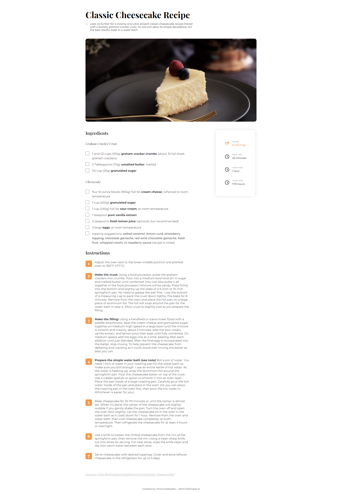

<!-- Please update value in the {}  -->

<h1 align="center">Recipe Page</h1>

   Solution for a challenge from  <a href="http://devchallenges.io" target="_blank">Devchallenges.io</a>.

  <h3>
    <a href="https://renancaldasdev.github.io/recipe-page/">
      Demo
    </a>
     | 
    <a href="https://github.com/renancaldasdev/recipe-page">
      Solution
    </a>
     | 
    <a href="https://devchallenges.io/challenges/OEKdUZ6xs0h99C38XVht">
      Challenge
    </a>
  </h3>

<!-- TABLE OF CONTENTS -->

## Table of Contents

- [Overview](#overview)
  - [Built With](#built-with)
- [Contact](#contact)

<!-- OVERVIEW -->

## Overview

### Built With

<!-- This section should list any major frameworks that you built your project using. Here are a few examples.-->

- [HTML5](https://developer.mozilla.org/en-US/docs/Glossary/HTML5)
- [CSS3](https://developer.mozilla.org/en-US/docs/Web/CSS)

## Contact

- Website [MyLinks](https://renancaldasdev.github.io/)
- GitHub [@renancaldasdev](https://github.com/renancaldasdev)
- Twitter [@renancaldas_dev](https://twitter.com/renancaldas_dev)
